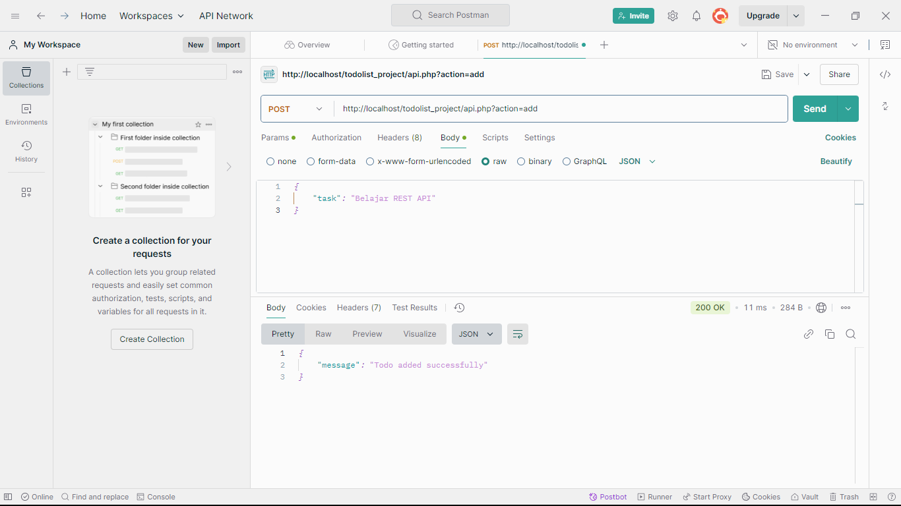
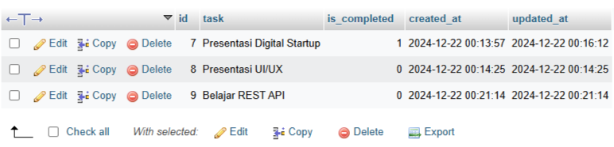
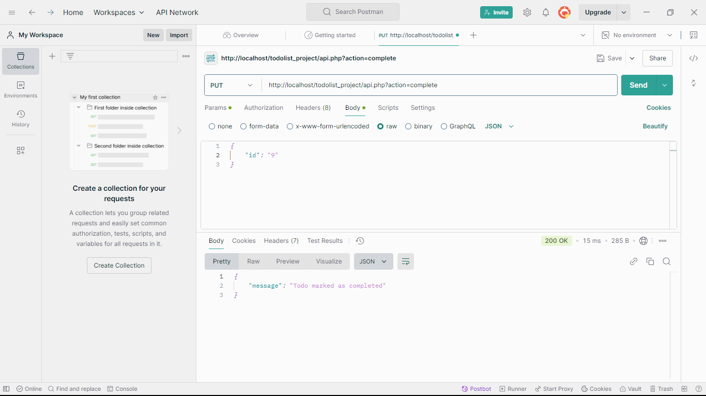
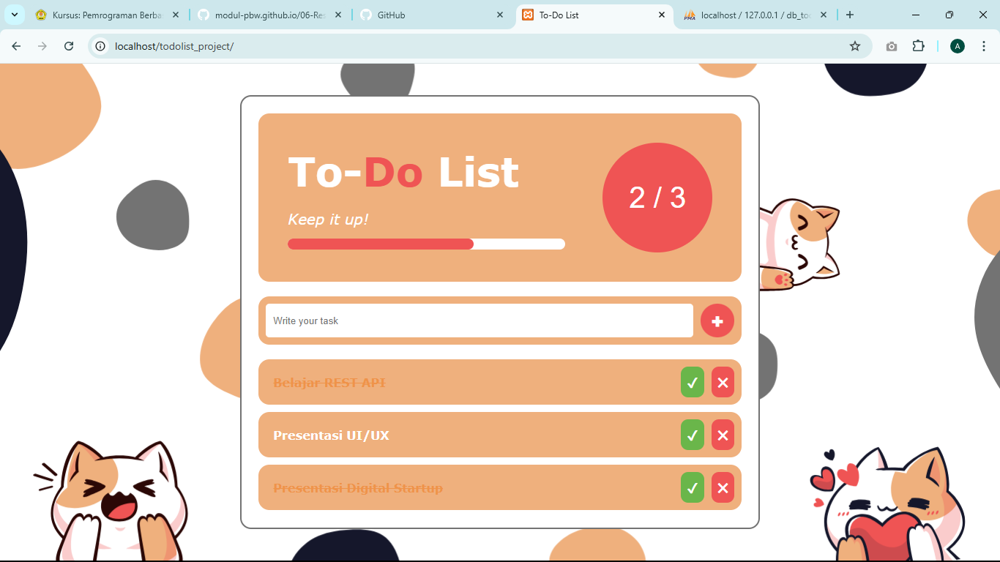
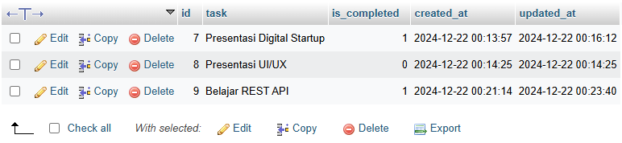
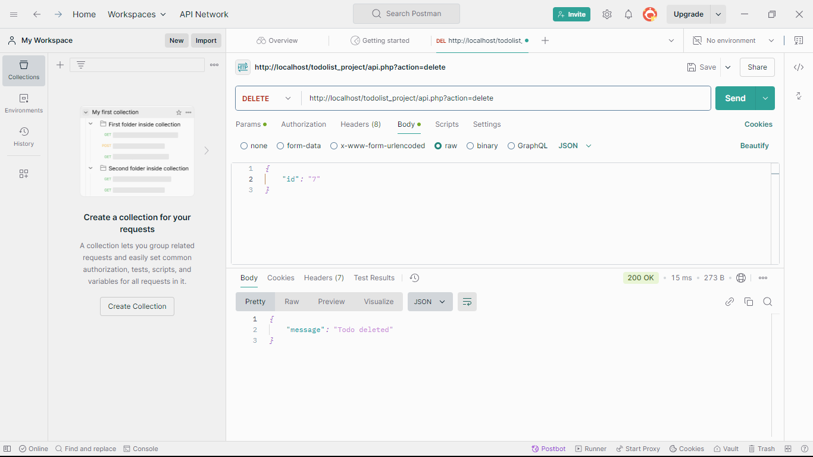
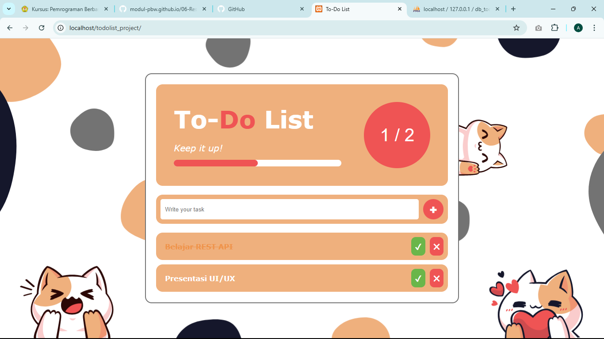
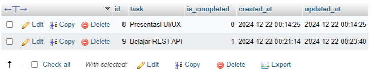
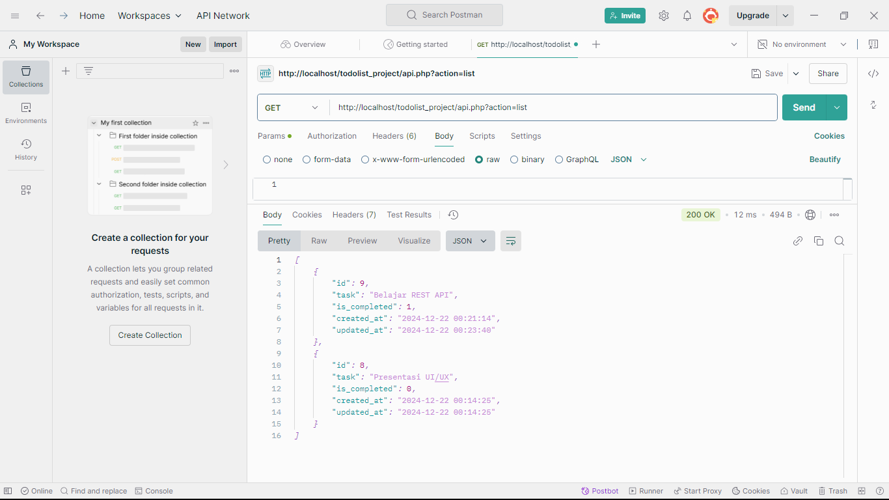
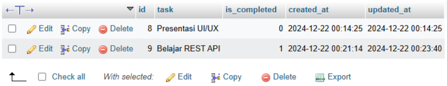

# Aplikasi To-Do List Menggunakan REST API
Ini adalah **aplikasi To-Do List** dengan **REST API** sederhana untuk mengelola daftar tugas, yang mendukung operasi CRUD (Create, Read, Update, Delete). Di sini, saya menggunakan `Postman` untuk melakukan pengujian API.

## 🔬 Pengujian API
### 1. POST - Menambahkan todo baru
- **Tampilan di Postman:**

- **Tampilan di Browser:**

- **Tampilan di Database:**

### 2. PUT - Menandai todo sebagai selesai berdasarkan ID
- **Tampilan di Postman:**

- **Tampilan di Browser:**

- **Tampilan di Database:**

### 3. DELETE - Menghapus todo berdasarkan ID
- **Tampilan di Postman:**

- **Tampilan di Browser:**

- **Tampilan di Database:**

### 4. GET - Mendapatkan semua todo
- **Tampilan di Postman:**

- **Tampilan di Browser:**

- **Tampilan di Database:**

